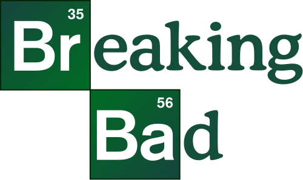
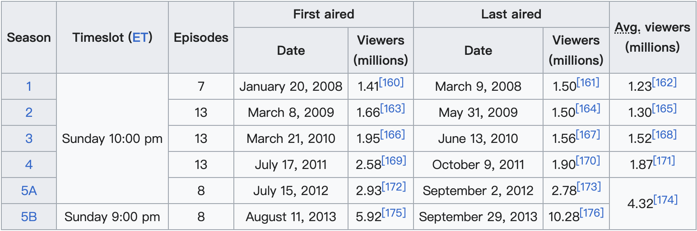
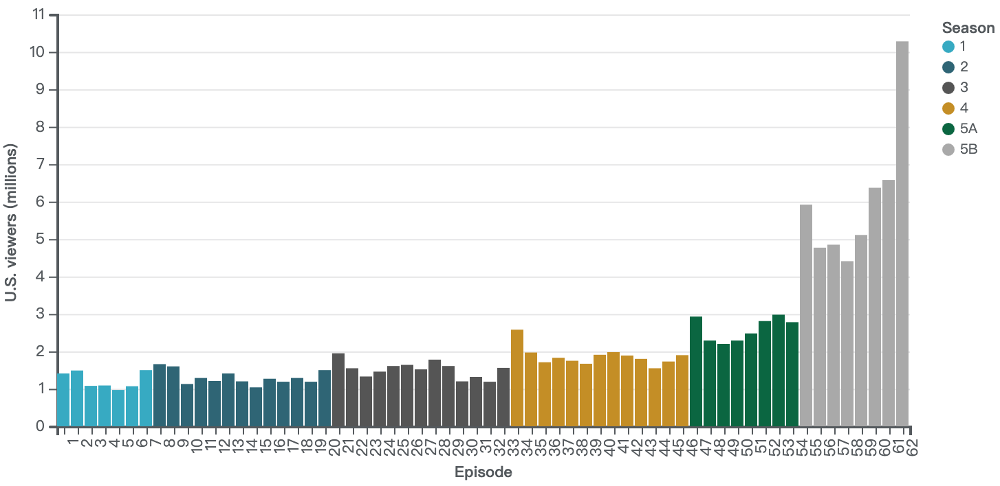

```{r setup, include=FALSE}
knitr::opts_chunk$set(echo = TRUE)
library(reticulate)
library(chron)
#py_install("pandas")
```

---

This article is based from [wikipedia](https://en.wikipedia.org/wiki/Breaking_Bad).

# Short Description
*Breaking Bad* is an American crime drama television series created and produced by Vince Gilligan. Set and filmed in Albuquerque, New Mexico, the series follows Walter White (Bryan Cranston), an underpaid, overqualified, and dispirited high-school chemistry teacher who is struggling with a recent diagnosis of stage-three lung cancer. White turns to a life of crime and partners with a former student, Jesse Pinkman (Aaron Paul), to produce and distribute methamphetamine to secure his family's financial future before he dies, while navigating the dangers of the criminal underworld. The show aired on AMC from January 20, 2008, to September 29, 2013, consisting of five seasons for a total of 62 episodes.


<p style="text-align:center">
  
</p>


# Basic Ratings

*Breaking Bad* received widespread critical acclaim and has been praised by many critics as one of the greatest television shows of all time. On the review aggregator website Metacritic (using a scale of 0–100), the first season scored 73, the second 84, the third 89, the fourth 96, and the fifth 99. The American Film Institute listed *Breaking Bad* as one of the top ten television series of 2008, 2010, 2011, 2012 and 2013. In 2013, TV Guide ranked it as the ninth greatest TV series of all time. By its end, the series was among the most-watched cable shows on American television, with audience numbers doubling from the fourth season to the fifth.

| Season       | Rotten Tomatoes  | Metacritic |
|:------:    |:-----:|:-------:|
| 1 | 86% (8.3/10 average rating)  | 73      |
| 2  | 97% (9.1/10 average rating) | 84      |
| 3  | 100% (9.2/10 average rating) | 89      |
| 4 | 100% (9.6/10 average rating)  | 96      |
| 5 | 97% (9.5/10 average rating)  | 99      |


# Viewership

*Breaking Bad* premiered on the same night as both the NFC and AFC Championships in the 2008 NFL playoffs, an intentional decision by AMC hoping to capture the adult male viewership immediately following the planned end of the NFC game. The game ran over its time slot, cutting into *Breaking Bad*'s timeslot in most of America. As a result, the pilot had only about 1.4 million viewers. Coupled with the ongoing writers strike, the first season did not draw as large of a viewership as they expected. However, with subsequent seasons, viewership increased, avoiding the usual trend of downward viewership that most serialized shows had. Ratings further increased by the fourth season as, prior to airing, the previous seasons had been added to Netflix, boosting interest in the show. *Breaking Bad* is considered the first such show to have a renewed burst of interest due to the show being made available on Netflix. The second half of the final season saw record viewership, with the series finale reaching over 10.3 million viewers.

<p style="text-align:center">
  
</p>


<p style="text-align:center">
  
</p>
